# 🎬 Pipeline de Preparação de Dados Cinematográficos

## 📋 Visão Geral

Este notebook processa e integra dados oficiais do mercado cinematográfico brasileiro (2023-2025) a partir das bases da **ANCINE** (Agência Nacional do Cinema) e **IBGE**, gerando um dataset limpo e estruturado pronto para análises de mercado e clusterização.

## 🎯 Objetivo

Transformar dados brutos de bilheteria, salas de cinema e informações socioeconômicas em um dataset analítico único contendo **11+ milhões de sessões cinematográficas** com cobertura completa de:
- ✅ Características das obras (títulos, nacionalidade, gênero)
- ✅ Detalhes das sessões (horários, tipo, modalidade)
- ✅ Infraestrutura (salas, complexos, exibidores)
- ✅ Dados socioeconômicos (população, PIB per capita)
- ✅ Métricas de performance (público, ocupação)

---

## 📊 Dados de Entrada

### Fontes Oficiais

| Fonte | Descrição | Volume | Formato |
|-------|-----------|--------|---------|
| **ANCINE - Bilheteria** | Sessões diárias por exibidora | ~12M registros | CSV (zip) |
| **ANCINE - Salas** | Cadastro de salas e complexos | ~6.3K salas | CSV |
| **ANCINE - Tipos de Sessão** | Classificação das sessões | ~11M registros | Parquet |
| **IBGE - Municípios** | População + PIB municipal | 5.571 municípios | API |

### Período Coberto

- **2023:** 05/01/2023 a 03/01/2024 (52 semanas)
- **2024:** 04/01/2024 a 01/01/2025 (52 semanas)  
- **2025:** 02/01/2025 a 30/09/2025 (39 semanas)

**Total:** 143 semanas cinematográficas

---

## 🔄 Fluxo de Processamento

```mermaid
graph TB
    Start([🎬 INÍCIO]) --> Config[⚙️ Configuração<br/>Imports + Parâmetros]
    
    Config --> Load1[📥 Carregar Bilheteria<br/>ANCINE 2023-2025]
    Config --> Load2[📥 Carregar Salas<br/>Cadastro ANCINE]
    Config --> Load3[📥 Carregar Tipos<br/>Parquet Local]
    Config --> Load4[📥 Buscar IBGE<br/>População + PIB]
    
    Load1 --> Filter[🗓️ Filtrar Períodos<br/>Ano Cinematográfico]
    Load2 --> Join1
    Load3 --> TZ[🕐 Ajustar Timezone<br/>UTC → Brasília]
    Load4 --> Prep4
    
    Filter --> TZ
    TZ --> Join1[🔗 JOIN 1<br/>Sessões + Tipos<br/>CPB + Data + Sala]
    
    Join1 --> Check{✅ 100%<br/>Cobertura?}
    Check -->|Não| Remove[✂️ Remover<br/>Sem Tipo]
    Check -->|Sim| Cont1[📊 Continuar]
    Remove --> Cont1
    
    Cont1 --> Map1[🏷️ Mapear<br/>Tipo → Modalidade]
    Map1 --> Extract[📝 Extrair<br/>Nacionalidade CPB]
    Extract --> Join2[🔗 JOIN 2<br/>Sessões + Salas<br/>REGISTRO_SALA]
    
    Prep4[🧹 Preparar IBGE<br/>Limpar Nomes] --> Join3
    Join2 --> Fix[🔧 Corrigir<br/>MOGI-GUAÇU]
    Fix --> Join3[🔗 JOIN 3<br/>Sessões + IBGE<br/>Município + UF]
    
    Join3 --> Coverage{📊 Cobertura<br/>IBGE?}
    Coverage -->|99.9%+| Rules[⚙️ Regras de Negócio]
    Coverage -->|< 99.9%| Debug[🔍 Debugar]
    Debug --> Fix
    
    Rules --> Title[📝 TITULO_OBRA<br/>Brasil ou Original]
    Title --> Time[⏰ Variáveis Temporais<br/>Hora, Dia, Semana]
    Time --> Cinema[🎞️ Semanas Cinema<br/>Qui-Qua]
    Cinema --> Occup[📈 Ocupação<br/>Público/Assentos]
    
    Occup --> Incons{🚨 Ocupação<br/>> 110%?}
    Incons -->|Sim| Flag[🏴 Flag Inconsistente<br/>13K sessões 0.1%]
    Incons -->|Não| Valid
    Flag --> Report[📊 Gerar Relatório<br/>Salas Problema]
    
    Report --> Valid[✅ Validações]
    Valid --> Clean[🧹 Limpeza<br/>Remover Duplicatas]
    Clean --> Organize[📋 Organizar<br/>51 Colunas]
    Organize --> Preview[👁️ Preview<br/>Head + Stats]
    
    Preview --> Export[💾 Exportar<br/>Parquet 299MB]
    Export --> Dict[📖 Dicionário<br/>Metadados JSON]
    Dict --> End([🏁 FIM])
    
    style Start fill:#4CAF50,color:#fff
    style End fill:#4CAF50,color:#fff
    style Join1 fill:#2196F3,color:#fff
    style Join2 fill:#2196F3,color:#fff
    style Join3 fill:#2196F3,color:#fff
    style Report fill:#FF9800,color:#fff
    style Export fill:#9C27B0,color:#fff
```


---

## 📦 Output

### Arquivos Gerados

1. **`df_sessoes_limpo.parquet`** (299 MB)
   - 11.074.831 sessões
   - 51 colunas organizadas
   - Compressão Snappy

2. **`dicionario_df_sessoes_limpo.json`**
   - Metadados do dataset
   - Tipos de dados
   - % de valores nulos por coluna

3. **`relatorio_salas_inconsistentes.xlsx`**
   - 125 salas com problemas de cadastro
   - Capacidade sugerida (percentil 95)
   - Priorização por impacto

### Estrutura do Dataset Final (51 colunas)

#### ⏰ Temporais (12 colunas)
- `DATA_EXIBICAO`, `DATA_HORA_SESSAO`, `ANO_CINEMA`
- `ano_cinematografico`, `semana_cinematografica`
- `primeiro_dia_semana`, `ultimo_dia_semana`
- `HORA_SESSAO`, `DIA_SEMANA`, `DIA_SEMANA_NOME`
- `FIM_DE_SEMANA`, `FAIXA_HORARIA`

#### 🎬 Obra (6 colunas)
- `CPB_ROE`, `TITULO_OBRA`, `TITULO_ORIGINAL`, `TITULO_BRASIL`
- `NACIONALIDADE`, `PAIS_OBRA`

#### 🎫 Sessão (4 colunas)
- `TIPO_SESSAO`, `MODALIDADE`, `AUDIO`, `LEGENDADA`

#### 🏢 Sala (7 colunas)
- Identificação: `REGISTRO_SALA`, `NOME_SALA`, `CNPJ_SALA`
- Status: `SITUACAO_SALA`, `DATA_SITUACAO_SALA`, `DATA_INICIO_FUNCIONAMENTO_SALA`
- Capacidade: `ASSENTOS_SALA`

#### 🏬 Complexo (7 colunas)
- Identificação: `REGISTRO_COMPLEXO`, `NOME_COMPLEXO`
- Localização: `MUNICIPIO_SALA_COMPLEXO`, `UF_SALA_COMPLEXO`
- Características: `SITUACAO_COMPLEXO`, `DATA_SITUACAO_COMPLEXO`, `COMPLEXO_ITINERANTE`, `OPERACAO_USUAL`

#### 🎭 Exibidor (7 colunas)
- Identificação: `REGISTRO_EXIBIDOR`, `NOME_EXIBIDOR`, `CNPJ_EXIBIDOR`
- Empresa: `RAZAO_SOCIAL_EXIBIDORA`, `SITUACAO_EXIBIDOR`
- Grupo: `REGISTRO_GRUPO_EXIBIDOR`, `NOME_GRUPO_EXIBIDOR`

#### 📈 Métricas (3 colunas)
- `PUBLICO`, `OCUPACAO_BRUTA`, `SESSAO_INCONSISTENTE`

#### 🌍 Socioeconômicos - IBGE (4 colunas)
- `codigo_municipio`, `populacao`, `pib_total`, `pib_per_capita`

---

## 🔧 Tratamentos Aplicados

### Limpeza de Dados
- ✅ Remoção de 32.618 sessões sem tipo (0.3%)
- ✅ Correção de timezone (UTC → America/Sao_Paulo)
- ✅ Padronização de nomes de municípios (MOGI-GUAÇU)
- ✅ Remoção de 4 colunas duplicadas

### Enriquecimento
- ✅ Integração com dados IBGE (100% cobertura)
- ✅ Cálculo de semanas cinematográficas (quinta a quarta)
- ✅ Extração de nacionalidade a partir do CPB
- ✅ Mapeamento tipo → modalidade (A, B, C, D)
- ✅ Classificação de faixas horárias (6 faixas)

### Validação de Qualidade
- ✅ Detecção de ocupação inconsistente (>110%)
- ✅ Geração de relatório para correção na fonte
- ✅ Preservação de flags para análise posterior

---

## 📊 Estatísticas do Dataset

### Volume
- **Sessões:** 11.074.831
- **Obras únicas:** 2.054
- **Salas:** 3.769
- **Complexos:** 925
- **Exibidores:** 356
- **Municípios:** 458

### Distribuição
- **Nacionalidade:**
  - Estrangeira: 87.4%
  - Brasileira: 12.1%
  - Especial: 0.5%

- **Modalidade:**
  - Regular (A): 99.3%
  - Privada (D): 0.3%
  - Pré-Estreia (B): 0.3%
  - Mostra/Festival (C): 0.02%

- **Público:**
  - Total: 319+ milhões
  - Média/sessão: 28.8 pessoas
  - Mediana: 15 pessoas

---

## ⚙️ Requisitos

### Bibliotecas Python
```python
pandas==2.3.3
polars==1.35.1
numpy==2.3.4
requests==2.32.5
openpyxl  # Para Excel
```

### Recursos
- **RAM:** Mínimo 16GB (recomendado 32GB)
- **Disco:** ~500MB espaço livre
- **Tempo:** ~8-15 minutos execução completa

---

## 🚀 Como Usar

### 1. Preparar Ambiente
```bash
pip install pandas polars numpy requests openpyxl
```

### 2. Organizar Estrutura
```
projeto/
├── 0_preparacao_completa.ipynb
└── Bases/
    ├── AG_SCB_SESSAO_REDUZIDO.parquet  # Input
    ├── df_sessoes_limpo.parquet        # Output
    ├── dicionario_df_sessoes_limpo.json
    └── relatorio_salas_inconsistentes.xlsx
```

### 3. Executar Notebook
```python
# No Jupyter
# Run All Cells
# Tempo: ~8-15min
```

### 4. Carregar Resultado
```python
import pandas as pd

# Carregar dataset processado
df = pd.read_parquet('../Bases/df_sessoes_limpo.parquet')

# Explorar
print(f"Sessões: {len(df):,}")
print(f"Colunas: {len(df.columns)}")
df.head()
```

---

## 🎯 Casos de Uso

### Análises Suportadas
1. **Tendências Temporais**
   - Sazonalidade por semana cinematográfica
   - Horários de pico por dia da semana
   - Evolução ano a ano

2. **Performance de Mercado**
   - Box office por obra/exibidor
   - Ocupação média por tipo de sala
   - Distribuição geográfica

3. **Clusterização**
   - Perfis de complexos (localização, porte, operação)
   - Segmentação de municípios (socioeconômico)
   - Grupos de obras similares (performance)

4. **Modelagem Preditiva**
   - Previsão de público
   - Otimização de grade de horários
   - Análise de viabilidade (novos complexos)

---

## 📝 Notas Importantes

### Limitações Conhecidas
- ⚠️ 0.1% das sessões sem dados IBGE (13K sessões em MOGI GUAÇU)
- ⚠️ 0.1% com ocupação >110% (erro de cadastro de capacidade)
- ⚠️ 12.6% sem título em português (obras estrangeiras)

### Decisões de Design
1. **Remoção de sessões sem tipo:** Preferimos qualidade sobre volume (perda de apenas 0.3%)
2. **Manutenção de inconsistências:** Flagged mas não removidas (transparência para análise)
3. **Join conservador com IBGE:** Mantém registros mesmo sem match (99.9% sucesso)

### Próximos Passos
1. Análise exploratória (EDA)
2. Feature engineering para ML
3. Clusterização de salas/complexos
4. Modelagem preditiva de público

---

## 👨‍💻 Autor

**Guilherme Gustavo Roca Arenales**
- Projeto: Análise de Mercado Cinematográfico Brasileiro
- Instituição: ENAP
- Data: Novembro 2025

---

## 📄 Licença

Dados públicos da ANCINE e IBGE. Consulte as políticas de cada fonte para restrições de uso.

---

## 🔗 Links Úteis

- [ANCINE - Dados Abertos](https://dados.ancine.gov.br/)
- [IBGE - API Agregados](https://servicodados.ibge.gov.br/api/docs/agregados)
- [Documentação Pandas](https://pandas.pydata.org/)
- [Documentação Polars](https://pola.rs/)

---

**🎬 Dataset pronto para revolucionar análises do mercado cinematográfico brasileiro!**